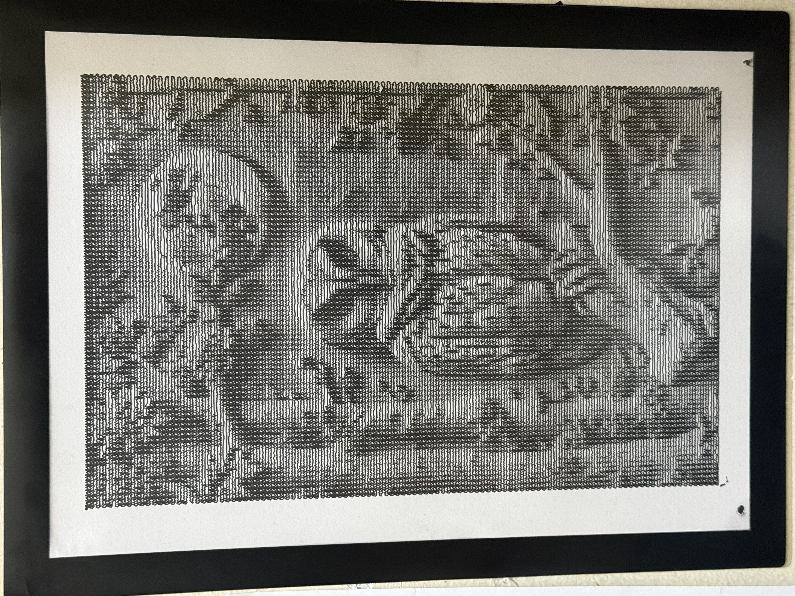
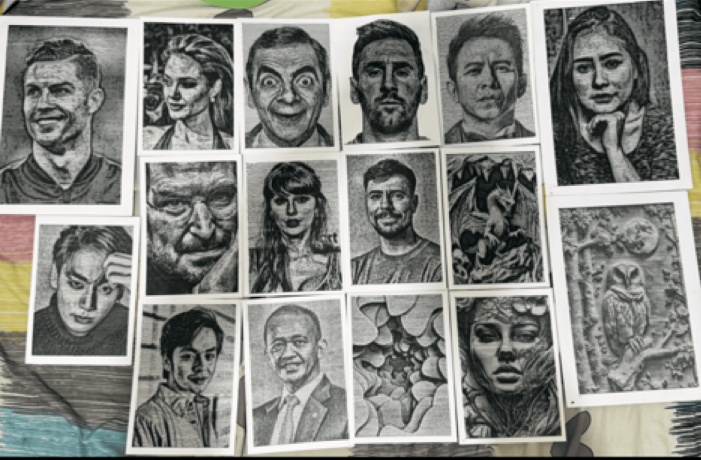

# Squiggle Art

## Turn Photos into Plotter-Ready G-Code in Seconds

Squiggle Art is a portable Windows tool that converts PNG, JPG, and JPEG images into continuous squiggle-style line art and customizable G-code for pen plotters, CoreXY machines, and DIY drawing robots.

Upload an image, adjust the settings, preview the result, and generate G-code in seconds.

## Features

- PNG, JPG, and JPEG image support
- Continuous horizontal squiggle line art
- A4 drawing area support
- Adjustable image width and height
- Adjustable line spacing
- Adjustable wave strength and density
- Adjustable contrast and feed rate
- Adjustable servo pen-up angle
- Preview before generating G-code
- Portable application
- No Python installation required

## Download the Portable Version

Get the ready-to-use Windows application on Gumroad:

[Download Squiggle Art on Gumroad](https://penplotterindonesia.gumroad.com/)
[FREE TEST G-code ALBERT EINSTEIN — Wave-Line G-code Continuous Line • No Pen Lift on Gumroad]([https://penplotterindonesia.gumroad.com/](https://penplotterindonesia.gumroad.com/l/flpxqb)

The download includes the complete portable application. No coding or Python installation is required.

## System Requirements

- Windows 10 or Windows 11, 64-bit
- Chrome, Microsoft Edge, or Firefox
- A compatible pen plotter or CoreXY drawing machine

The generated G-code may require machine-specific calibration.

## Plotter Results

### High-contrast portrait

### Plotter artwork

These examples were created with a pen plotter using generated G-code. Final results may vary depending on the machine, pen, paper, servo, and calibration settings.

## How it works

Watch the demo:

[Watch Squiggle Art in action](https://youtu.be/BOywTU-rB6A?si=aG4Yzy8Z2oVsyNYY)

## Custom Work

Need a custom portrait, icon, anime character, or pet drawing?

Contact me on Reddit:

u/Penplotterindonesia8

## Important

This product generates G-code. It does not include a physical plotter or pen hardware.

Digital product. Windows only.
